# mTLS Handshake Comparison: TLS 1.0 - 1.3

Sequence diagrams generated from live mTLS handshake packet captures.
Each diagram shows the actual message exchange observed on the wire,
highlighting where client identity information is exposed to passive observers.

## TLS 1.0

**Cipher suite:** `TLS_ECDHE_RSA_WITH_AES_256_CBC_SHA (0xc014)`

```mermaid
sequenceDiagram
    participant C as Client (DOE.JOHN.1234567890)
    participant S as Server (localhost)

    C->>S: ClientHello
    S->>C: ServerHello, Certificate, ServerKeyExchange, CertificateRequest, ServerHelloDone
    rect rgb(96, 96, 96)
        Note over C,S: CLIENT IDENTITY VISIBLE IN CLEARTEXT
        C->>S: Certificate, ClientKeyExchange, CertificateVerify
        Note right of S: CN=DOE.JOHN.1234567890
        Note right of S: urn:uuid:f81d4fae-7dec-11d0-a765-00a0c91e6bf6
        Note right of S: http://ocsp.test.gov/piv
        Note right of S: http://pki.test.gov/certs/PIVAuthCA.cer
        Note right of S: http://pki.test.gov/crl/PIVAuthCA.crl
    end
    C->>S: ChangeCipherSpec, Finished
    S->>C: NewSessionTicket, ChangeCipherSpec
```

In TLS 1.0, the client Certificate message is sent in **cleartext**
before the ChangeCipherSpec. A passive observer can extract:

- **Subject DN:** CN=DOE.JOHN.1234567890
- **SAN URIs:** urn:uuid:f81d4fae-7dec-11d0-a765-00a0c91e6bf6, http://ocsp.test.gov/piv, http://pki.test.gov/certs/PIVAuthCA.cer, http://pki.test.gov/crl/PIVAuthCA.crl
- **SAN email:** john.doe@test.gov
- **Certificate policies** (FPKI OIDs)
- **CRL Distribution Points / OCSP URIs**
- **Issuer chain** (full CA hierarchy)

---

## TLS 1.1

**Cipher suite:** `TLS_ECDHE_RSA_WITH_AES_256_CBC_SHA (0xc014)`

In TLS 1.1, the client Certificate message is sent in **cleartext**
before the ChangeCipherSpec. A passive observer can extract:

- **Subject DN:** CN=DOE.JOHN.1234567890
- **SAN URIs:** urn:uuid:f81d4fae-7dec-11d0-a765-00a0c91e6bf6, http://ocsp.test.gov/piv, http://pki.test.gov/certs/PIVAuthCA.cer, http://pki.test.gov/crl/PIVAuthCA.crl
- **SAN email:** john.doe@test.gov
- **Certificate policies** (FPKI OIDs)
- **CRL Distribution Points / OCSP URIs**
- **Issuer chain** (full CA hierarchy)

---

## TLS 1.2

**Cipher suite:** `TLS_ECDHE_RSA_WITH_AES_256_GCM_SHA384 (0xc030)`

In TLS 1.2, the client Certificate message is sent in **cleartext**
before the ChangeCipherSpec. A passive observer can extract:

- **Subject DN:** CN=DOE.JOHN.1234567890
- **SAN URIs:** urn:uuid:f81d4fae-7dec-11d0-a765-00a0c91e6bf6, http://ocsp.test.gov/piv, http://pki.test.gov/certs/PIVAuthCA.cer, http://pki.test.gov/crl/PIVAuthCA.crl
- **SAN email:** john.doe@test.gov
- **Certificate policies** (FPKI OIDs)
- **CRL Distribution Points / OCSP URIs**
- **Issuer chain** (full CA hierarchy)

---

## TLS 1.3

**Cipher suite:** `TLS_AES_256_GCM_SHA384 (0x1302)`

```mermaid
sequenceDiagram
    participant C as Client (DOE.JOHN.1234567890)
    participant S as Server (localhost)

    C->>S: ClientHello
    S->>C: ServerHello, ChangeCipherSpec

    rect rgb(96, 96, 96)
        Note over C,S: ENCRYPTED TUNNEL — client identity hidden
        C->>S: ChangeCipherSpec
        S->>C: Application Data
    end
```

In TLS 1.3, the client Certificate message is sent inside the encrypted
tunnel established after the ServerHello. A passive observer sees only
opaque Application Data records — the client's identity (CN, SAN, policy
OIDs, CRL/OCSP URIs) is never exposed on the wire.

---

## Summary: Client Identity Visibility by TLS Version

| TLS Version | Client Certificate | Subject DN | SAN (UUID/email) | Policy OIDs | CRL/OCSP URIs | Cipher Suite |
|-------------|-------------------|------------|------------------|-------------|---------------|--------------|
| TLS 1.0 | **Cleartext** | **Visible** | **Visible** | **Visible** | **Visible** | TLS_ECDHE_RSA_WITH_AES_256_CBC_SHA (0xc014) |
| TLS 1.1 | **Cleartext** | **Visible** | **Visible** | **Visible** | **Visible** | TLS_ECDHE_RSA_WITH_AES_256_CBC_SHA (0xc014) |
| TLS 1.2 | **Cleartext** | **Visible** | **Visible** | **Visible** | **Visible** | TLS_ECDHE_RSA_WITH_AES_256_GCM_SHA384 (0xc030) |
| TLS 1.3 | Encrypted | Encrypted | Encrypted | Encrypted | Encrypted | TLS_AES_256_GCM_SHA384 (0x1302) |

## Why TLS 1.3 Is Different

In TLS 1.0-1.2, the handshake follows a pattern where the client sends its
Certificate message in cleartext, before encryption is established:

1. ClientHello / ServerHello negotiate parameters
2. Server sends its certificate and requests the client's
3. **Client sends its certificate in the clear**
4. ChangeCipherSpec enables encryption
5. Finished messages verify the handshake

TLS 1.3 restructures the handshake so that encryption begins immediately
after the ServerHello (using keys derived from the key share exchange):

1. ClientHello / ServerHello exchange key shares
2. **Encryption starts** — all subsequent messages are encrypted
3. Server sends EncryptedExtensions, Certificate, CertificateVerify, Finished
4. **Client sends Certificate, CertificateVerify, Finished (all encrypted)**

This means a passive network observer monitoring TLS 1.3 mTLS traffic
cannot determine the client's identity, organizational affiliation,
or certificate policy — information that is fully visible in earlier versions.
